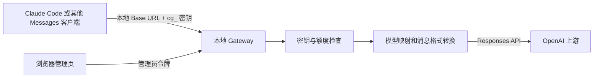

# 把 Claude Code 接到本地可控网关：Codex Claude Gateway 开源了

如果有多个本地应用需要调用同一个模型上游，直接给每个应用配置上游凭据，后续管理会很麻烦：模型名称各不相同，额度不容易分配，排查请求失败时也缺少统一入口。我做了一个运行在本机的轻量网关 **Codex Claude Gateway**，把这些配置放进一个 Web 管理页，并向 Claude Code 等客户端提供 Anthropic Messages 格式的接口。

项目地址：[github.com/yk4023/gpt_web_ui](https://github.com/yk4023/gpt_web_ui)。代码采用 MIT 许可证，只依赖 Node.js 标准库。

## 它是怎样工作的



客户端只需要知道本机的 Base URL 和网关生成的 `cg_...` 密钥。网关检查请求限额，把客户端模型别名映射到上游模型，将常见的文本、图片输入、工具调用和流式消息转换为 OpenAI Responses API 格式，再把结果转换回来。管理页可以查看最近请求、创建或吊销密钥、修改映射、切换已授权账号。

**它不读取、控制或复用 Codex 桌面窗口中的对话与登录态。** 上游是独立的 [Sign in with ChatGPT 授权](https://developers.openai.com/siwc/token-sharing-open-source/sign-in)，或用户自行提供的 OpenAI API Key。前者能否用于推理取决于账号、工作区、授予权限以及 OpenAI 的服务条件；后者按 API 计费。

## 五分钟上手

先安装 Node.js 24.5+ 或 22.21+，在 PowerShell 中运行：

```powershell
git clone https://github.com/yk4023/gpt_web_ui.git
cd gpt_web_ui
npm start
```

打开 <http://127.0.0.1:8765>。首次运行会生成 `.data/admin-token`，用下面的命令读取并登录管理页：

```powershell
Get-Content .data/admin-token
```

接下来依次做四件事：

1. **连接上游。** 点击“使用 ChatGPT 登录”，在 OpenAI 页面完成授权；如果使用自己的 API Key，则在启动网关前设置 `$env:OPENAI_API_KEY = '<你的 Key>'`。
2. **确认模型。** 点击“查询可用模型”，在模型映射中按需添加多行客户端别名与上游模型 ID 并保存。初始映射只是示例，不能据此判断账号有权限。
3. **创建调用密钥。** 为 Claude Code 建一个独立的 `cg_...` 密钥，设置每日请求、Token 和并发限制。完整密钥只显示一次。
4. **配置客户端。** 在“接入 Claude Code”选择主模型、Haiku/Sonnet/Opus 默认模型和子代理模型，填入网关密钥。可以复制 `env JSON` 到 Claude Code 的 `settings.json`，也可以切换为 PowerShell 格式，在同一个终端启动 `claude`。

手动配置时，最核心的是以下几项：

```powershell
$env:ANTHROPIC_BASE_URL = 'http://127.0.0.1:8765'
$env:ANTHROPIC_AUTH_TOKEN = '<管理页生成的 cg_... 密钥>'
$env:ANTHROPIC_MODEL = 'codex-sol'
claude
```

管理页会生成包含 `ANTHROPIC_AUTH_TOKEN`、`ANTHROPIC_BASE_URL`、主模型、Haiku/Sonnet/Opus 默认模型、子代理模型和 `CLAUDE_CODE_MAX_CONTEXT_TOKENS` 的完整 `env` JSON。各模型可以分别映射到不同上游。上下文数值可编辑，但不能扩大上游模型的实际容量；完整示例见 [README](../README.md)。

## 额度、代理和安全

管理页按所选网关密钥显示今日剩余请求数与 Token 数，它们是**网关自己设置的限制**，并不是 ChatGPT 或 Codex 账号真实剩余额度。当前授权没有余额查询接口，页面提供 [ChatGPT 官方用量入口](https://chatgpt.com/settings/usage)。上游会独立执行自己的额度与权限规则。由于 Token 数在请求结束后统计，边界处可能多放行一次请求；对严格预算管理不能只依赖这个计数器。

“使用趋势”提供近 14 日、12 周、12 月的图表，可在请求数和 Token 消耗之间切换。它使用本地持久化的每日汇总，按网关时区划分日期；从旧版本升级时会接续当天已有总数，但无法重建之前已清理的历史记录。这些图表不代表 ChatGPT 账号全部应用的官方用量。

需要通过受信任的本机代理连接上游时，可以把 [`config/network.example.json`](../config/network.example.json) 复制到 `.data/network.json` 并修改地址，或在启动前设置 `GATEWAY_PROXY_URL`。该选项只接受回环地址，授权、模型查询和推理会使用代理；客户端到本地网关的连接仍走 `127.0.0.1`。代理不能改变 [OpenAI 的服务地区要求](https://developers.openai.com/api/docs/supported-countries)。

`.data/` 保存管理员令牌、OAuth 凭据、网关密钥摘要、用量和本机代理配置，已被 Git 忽略。不要把这个目录、授权回调 URL 或 API Key 上传到仓库，也不要直接把本地监听端口暴露到公网。公开仓库中的配置文件只是示例，不包含实际凭据。

## 使用前知道这些限制

- 本项目实现的是常用 Anthropic Messages 到 Responses API 的转换，不保证覆盖全部 Claude 专有能力。Claude Code 官方的[网关兼容指南](https://code.claude.com/docs/en/llm-gateway-protocol)列出了客户端可能发送的接口和字段；建议先用小任务验证自己的版本。
- `/v1/messages/count_tokens` 返回的是本地字符估算，不是上游精确计费数值。
- 使用 ChatGPT 授权时，成功登录不等于任何模型都可用；要查询账号返回的模型列表，并用一次实际请求确认。
- 授权回调中的 code 是一次性的。若出现 `unsupported_country_region_territory`，应核对实际网络出口与[支持地区](https://developers.openai.com/api/docs/supported-countries)，不要反复打开同一个回调链接。
- 项目提供本地模拟上游的自动测试和 Claude Code 工具调用冒烟测试，但真实账号推理仍需在自己的合法环境中验证。

## 后续计划

接下来会优先完善协议覆盖范围、错误诊断和管理页的使用体验。欢迎通过 GitHub Issue 提交可复现的问题；提交日志前请先移除令牌、授权码与个人数据。

项目代码、运行说明和测试入口都在 [GitHub 仓库](https://github.com/yk4023/gpt_web_ui)。
